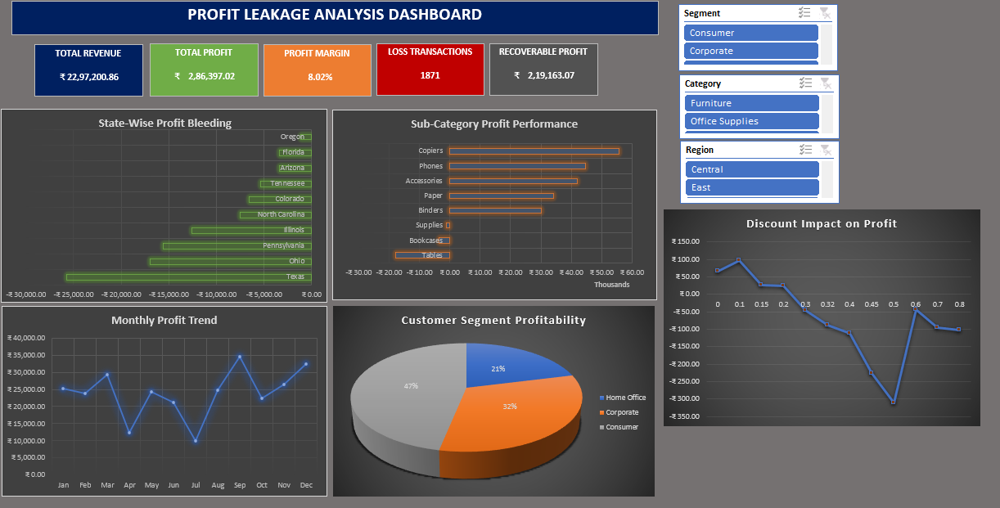

# Retail Profit Leakage Analysis System

## 📌 Project Overview

The Retail Profit Leakage Analysis System is an Excel-based business analytics project designed to identify hidden profit losses within a retail business and recommend strategies to improve profitability.

The project analyzes sales, profit, discounts, customer segments, product categories, and geographical performance to uncover the root causes of profit leakage.

---

## 🎯 Business Objective

The objective of this project was to:

- Identify sources of profit leakage
- Analyze loss-making products and regions
- Understand the impact of discounts on profitability
- Recommend corrective actions
- Estimate potential profit recovery

---

## 🛠 Tools & Technologies Used

- Microsoft Excel
- Power Query
- Pivot Tables
- Pivot Charts
- Excel Formulas
- Conditional Formatting
- KPI Cards
- Interactive Slicers
- Dashboard Design

---

## 🔍 Analysis Performed

### 1. Sub-Category Profit Performance

Top Performing Sub-Categories:
- Copiers
- Phones
- Accessories
- Paper
- Binders

Loss-Making Sub-Categories:
- Tables
- Bookcases
- Supplies

---

### 2. State-Wise Profit Bleeding Analysis

Highest Loss-Making States:
- Texas
- Ohio
- Pennsylvania

---

### 3. Discount Impact Analysis

Key Findings:
- Higher discounts reduce profitability.
- Discounts above 20% frequently result in losses.

---

### 4. Customer Segment Profitability

Segments Analyzed:
- Consumer
- Corporate
- Home Office

---

### 5. Monthly Profit Trend Analysis

Analyzed monthly profit fluctuations and seasonal trends.

---

## 💰 Profit Recovery Simulator

### Scenario 1: Cap Discounts at 20%

- Recoverable Profit: ₹138,515
- Profit Improvement: 48.36%

### Scenario 2: Eliminate Loss-Making Products

Products:
- Tables
- Bookcases
- Supplies

- Profit Improvement: 7.82%

### Scenario 3: Improve Performance in Loss-Making States

States:
- Texas
- Ohio
- Pennsylvania

- Profit Improvement: 20.34%

---

## 🚀 Combined Impact

Current Profit: ₹286,397

Potential Profit: ₹505,560

Total Improvement: **76.52%**

---

## 📷 Dashboard Preview

---

## 📷 Profit Recovery Simulator

---

## 📷 Analysis Screens

### Analysis 2

### Analysis 3

### Analysis 4 & 5

---

## 📌 Key Business Recommendations

- Restrict discounts to 20%
- Review loss-making products
- Improve performance in Texas, Ohio and Pennsylvania
- Focus on profitable customer segments
- Continuously monitor profit leakage

---

## 👨‍💻 Author

**Roopak K A**

MSc Applied Statistics and Data Analytics

Aspiring Data Analyst

Skills: Excel | SQL | Power BI | Python | Statistics | Data Visualization | Business Analytics
